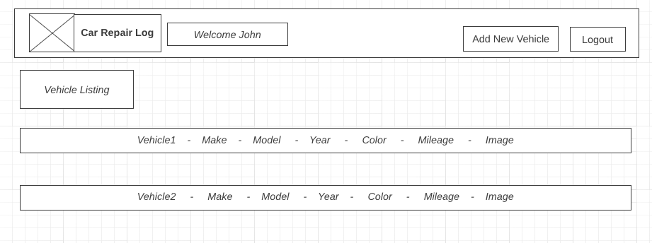
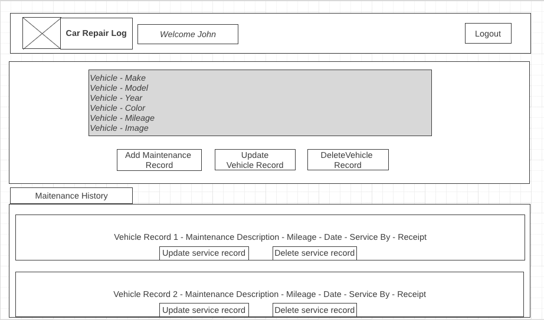
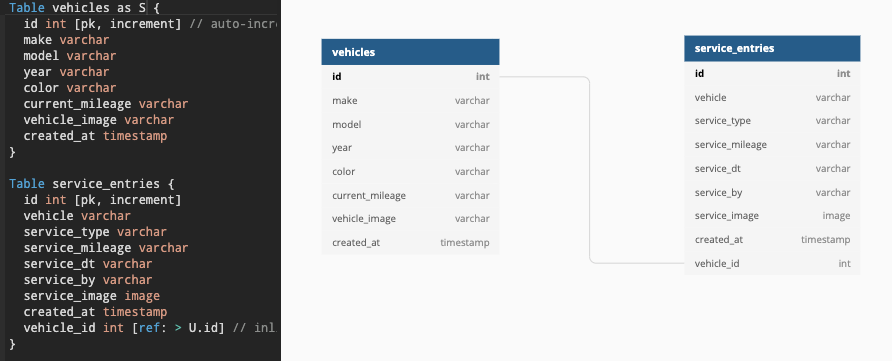

## AutoCare-Django-React

Car Maintenance Log Application...

## Major Functionalities

* Main car Listing page
    * Add vehicle

* Service listing page - Listing individual car and their service records
    * Add service record
    * Update vehicle record
    * Delete vehicle record
    * Update service record
    * Delete service record

## Screen Design
 
* [Main page - Vehicle listing](https://wireframe.cc/ohUxqa)

  

* [Vehicle maintenance details](https://wireframe.cc/cp5fH6)

  

## Application Technology

### FrontEnd

* ReactJS, HTML, CSS

### Backend 

* Django, Postgress, JSON

### Deployment

* Heroku

## Application Production Links

### Heroku

[Autocare Front End App](https://autocare-sei.herokuapp.com/)

[Autocare Back End App](https://enigmatic-harbor-74670.herokuapp.com/)

### Github

[Autocare Front End Repository](https://github.com/mpmrjd2020/AutoCare-React-Frontend)

[Autocare Back End Repository](https://github.com/mpmrjd2020/AutoCare-Django-React)

## Architecture

## Challenges - What To Look Forward To
* Nested model creation and developping logic around
* React Frontend with Django Backend architecture (debugging)
* Application has MVP - Additional functionalities
* Prioritization
* Refactoring
* Enhance the app

